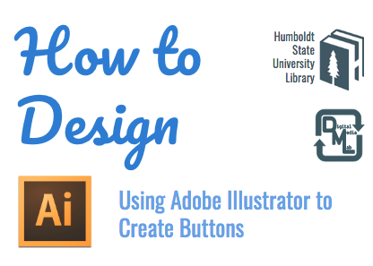
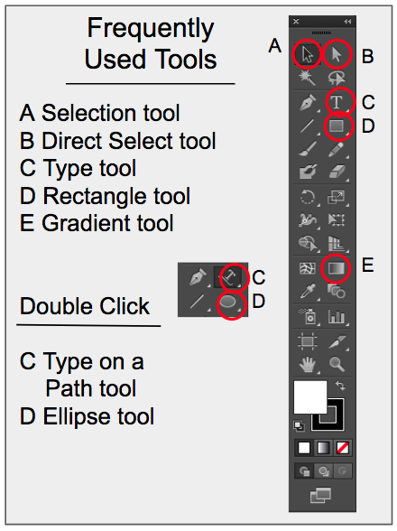
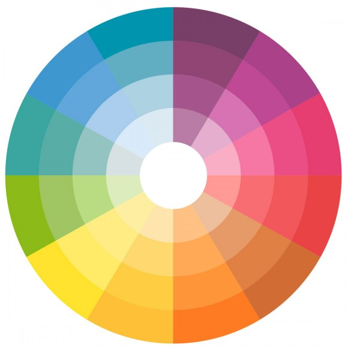

# How to Design Using Adobe Illustrator to Create Buttons
Learn more about the project and find additional links at the [project overview page](https://hsudml.github.io/designButtonAI/).

## Digital Media Lab Quick Guide
This short guide will get you started with your project. For more information about this or other topics, visit [http://libguides.humboldt.edu/dml](http://libguides.humboldt.edu/dml).

## Description

Buttons are our goal in this skillshop but we will learn the necessary tools that designers use to create flyers, logos, and much more! We will learn the importance of typography and color theory while applying fonts and vector illustrations to design our very own buttons.

Leave this skillshop better prepared to design a project using Adobe Illustrator, a creative program available to you on select computers on campus, including the Digital Media Lab (LIB 120).

## Step 1: Create Document

Begin with a new document that is the size of regular letter size paper (8.5” x 11”)

## Step 2: Create Content

First Decide what is the Purpose of this Button? Is it going to be for a club, a band, Your own Motto, A hobby, Quote, Book, an Author? 

Frequently Used Tools include (click the links to learn more): 
+ [Select Tool](https://helpx.adobe.com/illustrator/using/selecting-objects.html#select_objects_with_the_selection_tool)
+ Direct Select Tool
    + [Learn about the selection tools](https://helpx.adobe.com/illustrator/using/selecting-objects.html)
+ [Type Tool](https://helpx.adobe.com/illustrator/using/creating-text.html#creating_text)
+ [Rectangle Tool](https://helpx.adobe.com/illustrator/using/drawing-simple-lines-shapes.html#draw_rectangles_and_squares)
+ [Gradient Tool](https://helpx.adobe.com/illustrator/using/gradients.html#GradienttoolandGradientpanel)

If you double-click on click and hold on some tools you can find more options, such as: 

+ The type tool contains the [Type on Path tool](https://helpx.adobe.com/illustrator/using/creating-type-path.html), which allows you to place text following a shape or curved line (like your round button!)
+ The rectangle tool contains other shapes, like the [Ellipse tool](https://helpx.adobe.com/illustrator/using/drawing-simple-lines-shapes.html#draw_ellipses), which you can use to create round shapes. 

### Color

Deciding what is your content can help decide your font and color Scheme
Warm or Cool mood, school colors, Holiday Theme?

The Style Note blog has a nice page about using and choosing colors using the color wheel, [Styling 101: Color Combinations
](http://thestylenote.com/2013/04/09/styling-101-color-combinations/). 

## Step 3: Decide on A font & Download

Check out various Fonts that are on the Web to Better communicate what your button is about.

Free Websites to check out: 
+ [DAFONT.com](https://www.dafont.com/)
+	[fonts.google.com](https://fonts.google.com/)

### Next Download Font (Macs)

Once you decide on a font, click download.
Then double click the downloaded file in your Finder > under Downloads.

Then you will double click the .TTF file and it will download to your fontbook.

## Step 4: Check out Vector Illustrations

Vector Illustrations are often Created for Illustrator files, Similar to Clip Art but allow for infinite resizing without loss in quality.

Free Websites to check out: 
+ [Vecteezy.com](https://www.vecteezy.com/)
+ [Pixabay.com](https://pixabay.com/)

### Next Download Vector

Once you decide on a Vector Illustration click download.
Then double click the downloaded file in your Finder > under Downloads.

From Adobe Illustrator, you will place the image inside your Document.

Go to File > Place > and Find your Vector in Downloads.

Now that you have chosen your fonts and vector illustrations, you can put your button together. Below is a template of how to organize your ideas on how to create the button. 

Learn more about setting up your document and using these tools from this video, _Illustrator Basics in 3 Minutes_:

<iframe width="560" height="315" src="https://www.youtube-nocookie.com/embed/M5jOg2iDPeM" frameborder="0" allow="accelerometer; autoplay; encrypted-media; gyroscope; picture-in-picture" allowfullscreen></iframe>

## Step 3: Export & ready for Print!

Now that you have chosen your fonts and vector illustrations, you can finalize your design and then export your Adobe Illustrator file (.AI) into a Printable File (PDF).

Save your working file (.AI), then go to File > Click SAVE AS…  Type in your Project name and save it in Your Business Card folder. Save As .PDF

---
For more info visit: [http://libguides.humboldt.edu/dml](http://libguides.humboldt.edu/dml) or email skillshops@humboldt.edu

This guide has an open [Creative Commons license](https://creativecommons.org/share-your-work/licensing-types-examples/). You can use, share, remix and repurpose this content as long as you attribute the author, Christina Cordova [CC BY](https://creativecommons.org/licenses/by/4.0/), 2017. If you’re re-using this guide, we’d love to hear about your project- dml@humboldt.edu.
